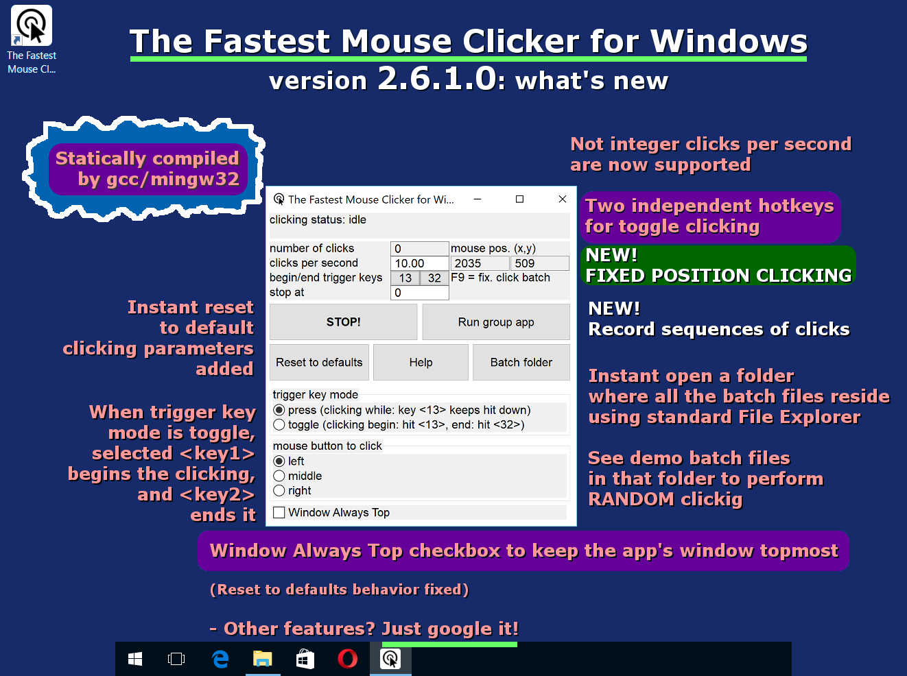
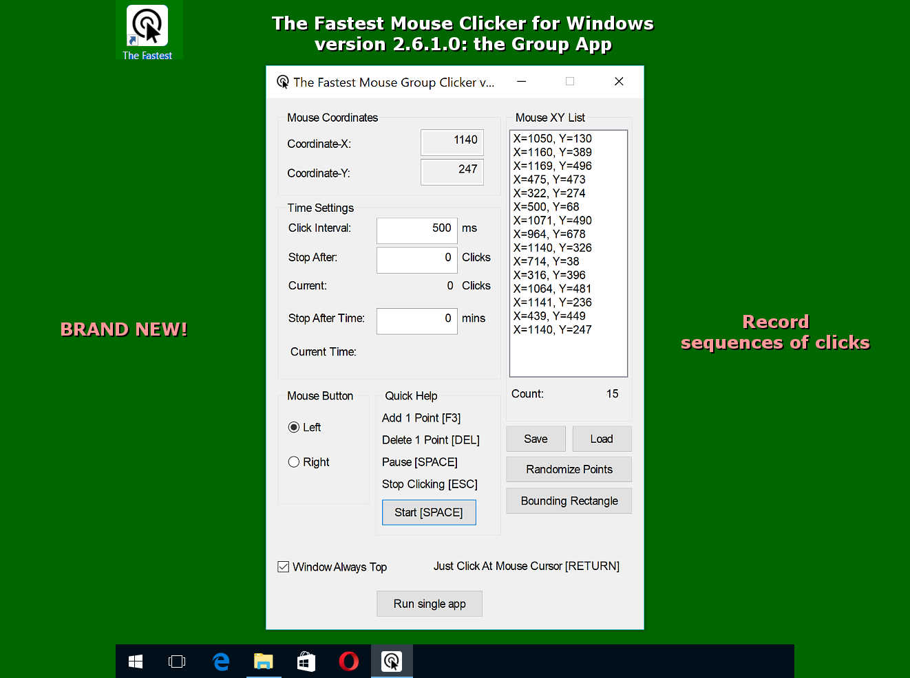
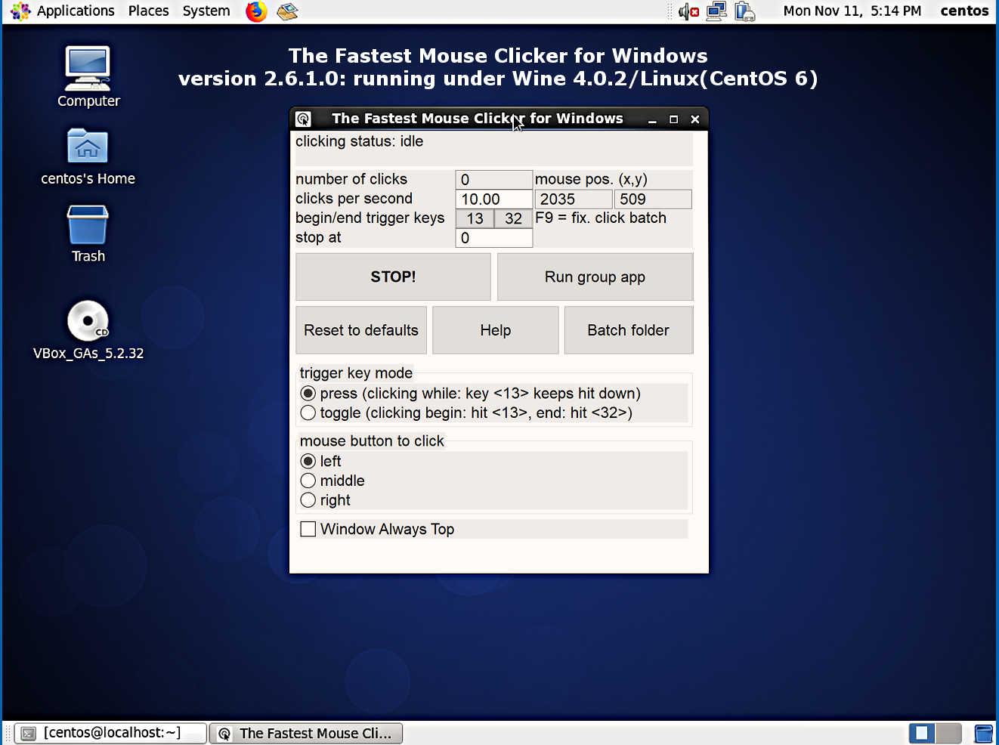
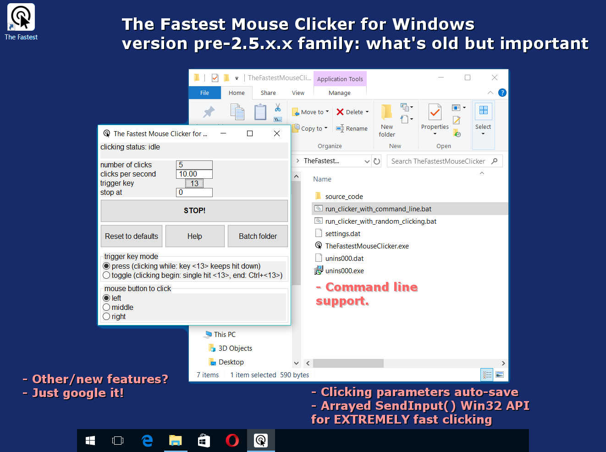
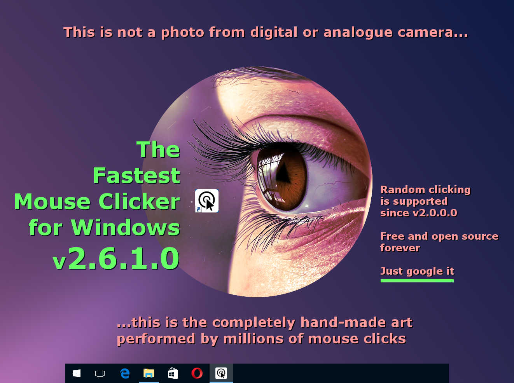
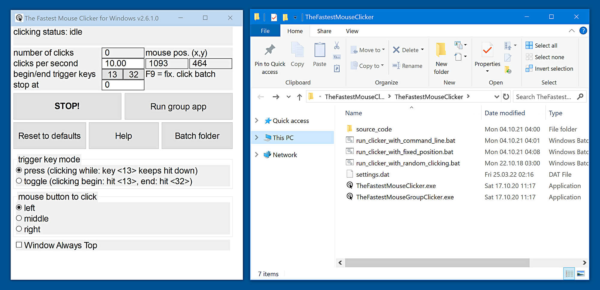

## {{ page.title | default: site.t['title'][page.lang] }}

### {{ page.description_rich | default: site.t['description_rich'][page.lang] }}

> {{ site.t['updated_text'][page.lang] }} : {{ site.t['updated_month'][page.lang] }} {{ site.upd_day_year }}.

#### 2025 is the project's 9th anniversary

## Quick Start

If you are playing Minecraft, Roblox or any other idle game, without assistance of a mouse auto-clicker app, the problem appears:
time needed to build your own universe in your favorite game is comparable to the time of existence of our Universe, metaphorically said.
Here why The Fastest Mouse Clicker for Windows comes to the scene.

### Welcome to download and install my flagship product!

<a href="{{ site.download_link_main }}" class="btn btn--stripe">Download {{ site.t['app_name'][page.lang] }} version {{ site.app_version }}</a>

    Mark this application as <strong style="color: #fff;">#clean</strong> in your Windows Defender, Windows Smart Screen, other antivirus software.

### What's New - The latest version&nbsp;{{ site.app_version }}

"Single" application | "Group" application
----- | -----
![{{ site.t['app_name'][page.lang] }} version 2.6.2.0: "Single" application](screenshots_new/v2.6.2.0/TFMCfW_v2.6.2.0.png) | ![{{ site.t['app_name'][page.lang] }} version 2.6.2.0: "Group" application](screenshots_new/v2.6.2.0/TFMCfW_g_v2.6.2.0.png)
![{{ site.t['app_name'][page.lang] }} version 2.6.1.0: "Single" application on Windows 11](screenshots_new/v2.6.1.0/tfmcfw-win11-22h2-sapp.jpg) | ![{{ site.t['app_name'][page.lang] }} version 2.6.1.0: "Group" application on Windows 11](screenshots_new/v2.6.1.0/tfmcfw-win11-22h2-gapp.jpg)

    <iframe
        width="200"
        height="auto"
        src="https://www.youtube.com/embed/X6tFX40n4dk?rel=0&modestbranding=1"
        title="Roblox Gambling With Auto Clicker: From Geoduck To Jackpot And Twins"
        frameborder="0"
        allow="accelerometer; autoplay; clipboard-write; encrypted-media; gyroscope; picture-in-picture"
        allowfullscreen
        loading="lazy" >
    </iframe>

#### ChangeLog

* Added long-awaited tooltips for the trigger keys.
* Live current mouse position indicator gets light green color.
* Long waiting new feature FIXED POSITION CLICKING.
* Fixed blurred GUI texts on 4K screens.
* Fixed wrong question about close old application during installation.
* Few minor bug fixes.

Found a bug or want a new feature? Create the [issue]({{ site.source_issues_url }}){:target="_blank"}!

Here is a brief intro video that tells how to download and install {{ site.t['app_name'][page.lang] }} in 2024-2025.
 <video style="outline:none; width:100%; height:100%;" controls preload="none" poster="/The-Fastest-Mouse-Clicker-for-Windows/videos/TFMCfW_intro_2024.jpg">
  <source src="/The-Fastest-Mouse-Clicker-for-Windows/videos/TFMCfW_intro_2024.mp4" type="video/mp4"/>
  Your browser does not support the video tag.
</video>
<a href="https://youtu.be/BwB65SpH3-I" target="_blank">Watch intro to {{ site.t['app_name'][page.lang] }} in Youtube.</a>

### Warning

> Please update your URLs:
>  — https://sourceforge.net/projects/fast-mouse-clicker-pro/
>  — https://sourceforge.net/projects/fastclicker/
>  are obsolete and points to the wrong locations.
>  <b>Official site is here</b>.

* NEW [Magic MSI Installer Template](https://github.com/windows-2048/Magic-MSI-Installer-Template){:target="_blank"}

    

----

## Table of Contents

* [Disambiguation](/The-Fastest-Mouse-Clicker-for-Windows/Disambiguation/)
* [Introduction](index.html#Introduction)
* [Features](/The-Fastest-Mouse-Clicker-for-Windows/Features/)
* [Comparison](/The-Fastest-Mouse-Clicker-for-Windows/Comparison/)
* [Technology](/The-Fastest-Mouse-Clicker-for-Windows/Technology/)
* [Mouse Polling Rate](/The-Fastest-Mouse-Clicker-for-Windows/Mouse-Polling-Rate/)
* [Source Code and The Fastest Mouse Clicker v3.0.0.0](/The-Fastest-Mouse-Clicker-for-Windows/Source-Code/)
* [Help How To Use](/The-Fastest-Mouse-Clicker-for-Windows/Help-How-To-Use/)
* [Screenshots](index.html#Screenshots)
* [Partners](index.html#Partners)
* [Video Reviews From Our Users](index.html#Reviews_from_our_users)
* [Frequently Asked Questions (FAQ)](index.html#FAQ)
* [Contacts](index.html#Contacts)

## Introduction

This is the official site to download various versions of {{ site.t['app_name'][page.lang] }}.
Introducing the fastest mouse clicker you have ever experienced!

Tired of slow, unresponsive mouse clickers that just don’t do the job? Look no further! Our revolutionary new mouse clicker app for Windows is here to change the game.

We take pride in utilizing the hidden power of the Win32 SendInput() API, which sets our app apart from all the competitors. This unique technology allows us to guarantee that our app is the fastest and most efficient mouse clicker available on the market.

So why wait? Boost your productivity and gaming experience with these incredible features:

* Unrivaled Speed: Say goodbye to lags and delays, our superior Win32 SendInput() API integration provides the smoothest and quickest mouse clicks you’ve ever experienced.

* Customizable Settings: Tailor your click rates and intervals to your specific needs, save presets, and switch between them with ease.

* Easy-to-use Interface: Navigate through the app effortlessly with our sleek and user-friendly design.

* Perfect for Gamers and Professionals: Whether you’re into MMORPG’s, time-limited tasks, or data entry, our mouse clicker app enhances your performance and reduces strain on your hands.

* Regular Updates: We constantly aim to improve and provide you with the latest features - our app evolves with you.

* Trusted by Thousands: Join our growing community of satisfied users who have experienced the power of the fastest mouse clicker app for Windows.

What are you waiting for? Experience lightning-fast clicks and improve your digital experience like never before. Download and install the ultimate app today - because you deserve the best!

All the versions are shipped with SHA256 fingerprints to ensure you do download the genuine software.

Industry standard free open source mouse auto clicker emulates Windows clicks EXTREMELY QUICKLY via arrays of 1-1000 mouse events in Win32 <code><a href="https://docs.microsoft.com/en-us/windows/win32/api/winuser/nf-winuser-sendinput" target="_blank">SendInput()</a></code>, making up to 100 000 clicks per second. Brand new group clicking support, Command line for batch files, Auto-save on exit, Random clicking, App's window always topmost are supported. This compact standalone program is compiled and statically linked by gnu/gcc compiler and supports all the Windows 7 to 10 and Linux via Wine emulator. This clicker is the best for incremental games: Cooking, Soda, Minecraft etc.

The program is written in vanilla C++ with native Win32 API and linked statically thus it becomes a super-compact executable without external dependencies and can run on a bare Windows installation.

Free and fast, open source, full-featured, statically-linked mouse auto clicker for Windows written in vanilla C++. Uses hardware-limited arrayed Win32 <code><a href="https://docs.microsoft.com/en-us/windows/win32/api/winuser/nf-winuser-sendinput" target="_blank">SendInput()</a></code> calls to reach up to 100000 clicks/s. Supports command line, random clicks and record-play the sequences of clicks.

This is a professional tool for both quality assistance workflow and video game cheating.
Using keyboard keys (or mouse buttons) as a trigger, you can position the mouse, then hit a key to click up to 100000 times every second,
10 times faster then abandoned project at [sourceforge.net](https://sourceforge.net/projects/fastclicker/){:target="_blank"}.
{{ site.t['app_name'][page.lang] }} allows you to set an activation key to switch automatic clicking . There are two activation modes:
"press": the app will repeat clicking as long as the activation key is being pressed, and
"toggle": a Begin activation key press activates automatic clicking until an End activation key press deactivates it.
Of course, you can select arbitrary Begin and End trigger keys.
You also have the option to set a click number limitation. The mouse auto-clicker stops automatically when your desired number of clicks is reached.

> New big version with FIXED POSITION CLICKING has been released!

{{ site.t['app_name'][page.lang] }} clicks the mouse automatically by emulating mouse clicking events.
The app has random in a box clicking feature, if you want that for some reason.
I plan to implement variative time interval between the clicks and allow you to choose a random interval range.
Hotkeys that trigger mouse clicks will be supported with almost every key modifiers, like SHIFT, CONTROL and ALT thus allow you to have SHIFT+\<Key\>, CONTROL+\<Key\> and ALT+\<Key\> triggers.
{{ site.t['app_name'][page.lang] }} is now suitable for Minecraft and Roblox auto-clicking, thanks to request from Xisuma user.
Also the program can be used as autoplayer for the game ClickerHeroes.
It can autoclick, activate skills, buy heroes and upgrades, and ascend and start all over.
All you need is to record and playback appropriate clicking sequence (see below).

You can auto-click the images, auto-fill the web forms, auto-submit a various type of requests with this auto-clicker.
For example, {{ site.t['app_name'][page.lang] }} can be used for scripting in Steam Summer Monster Minigame.
Another example, this program can be a bot for PTC websites like shorte.st, linkbucks, admy.link, etc. that automatically skips Ads.
The Group Clicker is a part of {{ site.t['app_name'][page.lang] }}. To run this extension simply click on "Run group app" button on the main window of {{ site.t['app_name'][page.lang] }}.
To return back to the previous app, click "Run single app" button.
The Group Clicker helps you to maintain separate sheet of data file from which Group Clicker can fetch data and use them row by row.
Also I plan to implement a schedule stored in a plain text file allowing you to auto-click on a webpage/URL at particular day and time.
You may add your own features by opening the solution file in Visual Studio and modifying source code.
The Windows installer opens corresponding folders by default.

Here is a short intro video that tells how to download and install {{ site.t['app_name'][page.lang] }}.
Also it shows basic quick-start guide to use automated clicks.
 <video style="outline:none; width:100%; height:100%;" controls preload="none" poster="videos/TFMCfW_intro.jpg">
  <source src="videos/TFMCfW_intro.mp4" type="video/mp4"/>
  Your browser does not support the video tag.
</video>
<a href="https://www.youtube.com/watch?v=gCpALY1WqmE" target="_blank">Watch intro to {{ site.t['app_name'][page.lang] }} in Youtube.</a>

There are a lot of use-cases of {{ site.t['app_name'][page.lang] }}.
Amateurs can use it for cheating in various web sites or video games such as Counter-Strike: Global Offensive (CS:GO), Candy Crush Saga, Roblox games, etc.
Professionals can use it for quality assistant and testing purposes because full support of command line in batch files, PowerShell scripts, etc.

## Screenshots

### Screenshots for the latest version 2.6.1.0 are here!

* The Fastest Mouse Clicker for Windows version 2.6.1.0 - Brand new Windows 11 22H2 screenshot.

* The Fastest Mouse Clicker for Windows version 2.6.1.0 - Brand new Windows 11 22H2 screenshot (group application).

* The Fastest Mouse Clicker for Windows version 2.6.1.0 - Brand new Windows 11 22H2 screenshot (install step 1).

* The Fastest Mouse Clicker for Windows version 2.6.1.0 - Brand new Windows 11 22H2 screenshot (install step 2).

* The Fastest Mouse Clicker for Windows version 2.6.1.0 - Brand new Windows 11 22H2 screenshot (install step 3).

* The Fastest Mouse Clicker for Windows version 2.6.1.0 - Brand new Windows 11 22H2 screenshot (install step 4).

* The Fastest Mouse Clicker for Windows version 2.6.1.0 - Brand new Windows 11 22H2 screenshot (install step 5).

* The Fastest Mouse Clicker for Windows version 2.6.1.0: introduce the "FIXED POSITION CLICKING" feature.

* The Fastest Mouse Clicker for Windows version 2.6.1.0: the brand new Group App in details.

* The Fastest Mouse Clicker for Windows version 2.6.1.0: running under Wine 4.0.2/Linux(CentOS 6).

* The Fastest Mouse Clicker for Windows version pre-2.5.x.x family: what's old but important.

* The Fastest Mouse Clicker for Windows version 2.6.1.0: completely hand-made art by the clicker application.

* The Fastest Mouse Clicker for Windows version 2.6.1.0 - Main app with batch folder that reveals "secret" features.

## Partners

What do our partners tell about The Fastest Mouse Clicker for Windows? Here are their reviews about my legendary software tool.

* [Bytesin](https://www.bytesin.com/software/The-Fastest-Mouse-Clicker-for-Windows/){:target="_blank"}, Your Daily Dose of Bytes

> The Fastest Mouse Clicker for Windows is a practical software tool designed to help you automate your clicks, thus eliminating repetitive manual tasks and saving time otherwise spent performing them.

* [Chocolatey](https://chocolatey.org/packages/fastest-mouse-clicker){:target="_blank"}, The Package Manager for Windows

> To install The Fastest Mouse Clicker for Windows, run the following command from the command line or from PowerShell: choco install fastest-mouse-clicker.

* [Github](https://github.com/windows-2048/The-Fastest-Mouse-Clicker-for-Windows){:target="_blank"}, Built for Developers

> In 2023, my flagship project celebrates the 7th anniversary! You can download and install the anniversary re-release at GitHub.

* [Gitlab](https://gitlab.com/mashanovedad/The-Fastest-Mouse-Clicker-for-Windows){:target="_blank"}, Simplify Your Workflows

> All future versions of The Fastest Mouse Clicker for Windows will be cross-platform and made with Qt.

* [Lamerkomp](https://lamerkomp.ru/load/sistemnye_utility/avtoklikery/the_fastest_mouse_clicker_for_windows/56-1-0-6328){:target="_blank"}, Download Freeware without Registration

> The autoclicker interface is simple, but it is recommended to read the Help before using it. You can select the mouse button for automatic clicks (left, right or middle), specify the frequency and the total number of clicks.

* [Majorgeeks](http://m.majorgeeks.com/files/details/the_fastest_mouse_clicker_for_windows.html){:target="_blank"}, It's Geekalicious

> The Fastest Mouse Clicker for Windows permits repetitive tasks to be carried out with the possibility of customization via the GUI or the Command Line. This little utility has one of the best click rates, with rates pushing 100k clicks per second.

* [OSDN](https://osdn.net/projects/fastest-clicker/){:target="_blank"}, Develop and Download Open Source Software

> In few words, the application is ready for auto-clicking IMMEDIATELY, once you run it and press the trigger key that defaults to scan code 13, i.e. the key is ENTER (RETURN).

* [Softpedia](https://www.softpedia.com/get/System/OS-Enhancements/The-Fastest-Mouse-Clicker-for-Windows.shtml){:target="_blank"}, Free Downloads Encyclopedia

> The Fastest Mouse Clickers for Windows is a practical software tool designed to help you automate your clicks, thus eliminating repetitive tasks and saving time otherwise spent performing them.

* [filerox](https://the-fastest-mouse-clicker-for-windows.en.filerox.com/){:target="_blank"}, A website which is created for providing best free services to our users. There are lot of reasons available behind filerox.com website foundation

> The Fastest Mouse Clicker For Windows for Windows is a program for Windows which fall in Action category.  This app is one of the most popular app among it's users due to certain reasons. It can help you in Emulate endless clicks. or tasks related to Action. So in case if you are looking for a solution or any app in Action than in that case The Fastest Mouse Clicker For Windows for Windows can help you a lot.

* [autohotkey](https://www.autohotkey.com/boards/viewtopic.php?style=1&t=74519){:target="_blank"}, Let's help each other out

> Industry standard free open source mouse auto clicker emulates Windows clicks EXTREMELY QUICKLY via arrays of 1-1000 mouse events in SendInput() Win32 API, making up to 100 000 clicks per second. Independent keyboard trigger keys (or mouse buttons), Command line for batch files, Auto-save on exit, Random clicking, App's window always topmost are supported. This compact standalone program is compiled and statically linked by gnu/gcc compiler and supports all the Windows 7 to 10 and Linux via Wine emulator. This clicker is the best for incremental games: Cooking, Soda, Minecraft etc.

* [Uptodown](https://the-fastest-mouse-clicker-for-windows.en.uptodown.com/windows){:target="_blank"}, Download Discover Share

> The Fastest Mouse Clicker for Windows is exactly what its name suggests: a program emulates many clicks automatically. With this program, you can emulate more than one hundred thousand clicks in one second. And of course, you can choose any of your mouse's buttons.

* [Softlay](https://www.softlay.com/downloads/the-fastest-mouse-clicker){:target="_blank"}, Emulate Endless Clicks

> The Fastest Mouse Clicker for Windows is specifically designed to enable users to click more than one hundred thousand times in one second. This useful automatic mouse clicker for Windows eliminates the need to click again and again. Quite useful in gaming, this free auto clicker software utility is very easy to customize and has the right set of tools to automate repetitive tasks for your Windows PC.

## Video reviews from our users

Wolf0626, young vlogger shows how he downloads, installs and runs The Fastest Mouse Clicker for Windows on his PC.
 <video style="outline:none; width:100%; height:100%;" controls preload="none" poster="videos/VideoReview_Wolf0626.jpg">
  <source src="videos/VideoReview_Wolf0626.mp4" type="video/mp4"/>
  Your browser does not support the video tag.
</video>
<a href="https://www.youtube.com/watch?v=f92nqHFxcmk" target="_blank">Watch the review video "How to Download the fastest mouse clicker for windows!!!" in Youtube.</a>

BullyWiiPlaza, experienced youtuber shows how he cheats extra scores with The Fastest Mouse Clicker for Windows in his mature gameplay.
 <video style="outline:none; width:100%; height:100%;" controls preload="none" poster="videos/VideoReview_BullyWiiPlaza.jpg">
  <source src="videos/VideoReview_BullyWiiPlaza.mp4" type="video/mp4"/>
  Your browser does not support the video tag.
</video>
<a href="https://www.youtube.com/watch?v=weoSf-CppZU" target="_blank">Watch the review video "[Yu-Gi-Oh! Duel Links] The Fastest Auto Clicker for Windows Gameplay" in Youtube.</a>

## Frequently Asked Questions (FAQ)

### Does the clicker work when its main GUI window is minimized?

Yes, it does. Trigger keys are being intercepted and mouse events are being emitted
regardless the application window state is: normal, maximized, minimized, focus, blur, etc.

### What if I want to emulate 2 clicks within every 3 seconds, what the 'clicks per second' parameter should be?

You have to type 0.67 inside 'clicks per second' input field. Just click on it, delete previous value, and type new one.

### What is minimal Windows version supported?

Your PC must have Windows 7 or later. Don't use Windows XP. Better use Windows 10. Windows 11 is also supported.

### When I open many windows simultaneously on my desktop and start to emulate mouse clicks, I lose the GUI window of the app. Why?

That's because you forget about checkbox named "Window Always Top". It is specially designed to prevent such a situation.
Once you check it, main GUI window of the program will be layered always topmost (above all the other windows on your desktop).

### What about sequences of clicks?

Work with sequences of clicks is supported since v2.5.x.x. To avoid GUI complication, second "Group" application is implemented.
To run that app from main "Single" app just press a "Run group app" button. To return to main app press "Run single app" button.

### Does your program run on bare Windows, like Windows Home on a laptop just from store?

Yes. Unlike all other auto-clickers this app is statically linked and has no external dependencies (e.g. "The application was unable to start correctly (0xc000007b)" from incorrect linkage against MSVC run-time DLLs).

### Does your app support multiple subsequent mouse clicks?

Yes, it does. But the Help text is not ready yet. Although the GUI is simple and intuitive
and based on the one of the most famous auto-clickers in the past. To do subsequent clicking,
just run the main app, click the "Run group app" button and see the "Quick Help" area just below the center of the window.

### I observe many other auto-clickers do not support 4K displays. What about your one?

I did that work essentially and have fixed that issue by adjusting font sizes on the fly and embedding a proper xml manifest into app binary.

### Is this FAQ nearly complete?

Oh no :) It has been just started. Feel free to ask your question via email. See the Contacts chapter below.

### What a secret do top-notch Roblox users hide from you in 2025

[Here](https://www.robloxforum.com/threads/what-a-secret-do-all-roblox-users-hide-from-you-in-2025.110763){:target="_blank"} is the answer.

    <iframe
        width="200"
        height="auto"
        src="https://www.youtube.com/embed/eJTDUooYrSs?rel=0&modestbranding=1"
        title="What a secret do all Roblox users hide from you in 2025"
        frameborder="0"
        allow="accelerometer; autoplay; clipboard-write; encrypted-media; gyroscope; picture-in-picture"
        allowfullscreen
        loading="lazy" >
    </iframe>

## Contacts

#### {{ site.t['copyright_text'][page.lang] }} [{{ site.t['author_name'][page.lang] }}]({{ site.prod-url }}{{ site.t['home'][page.lang] }})
