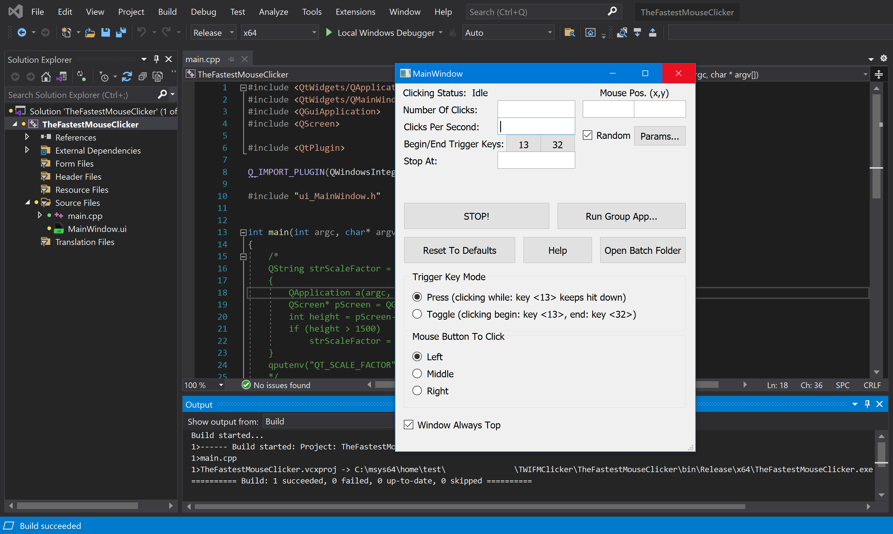
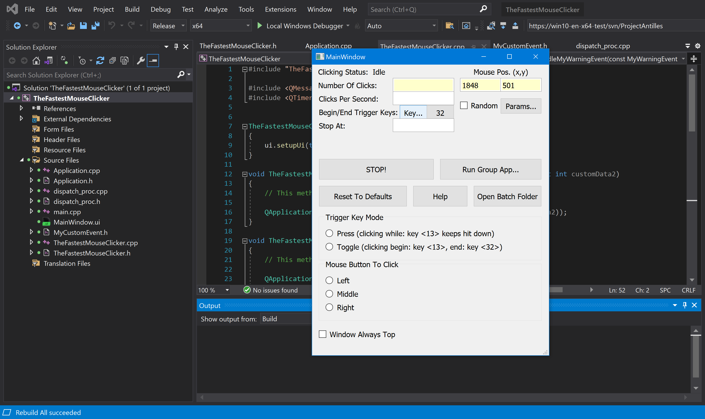
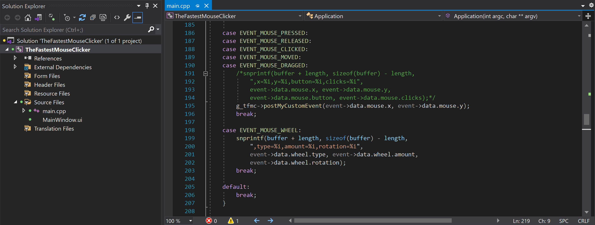

## {{ page.title | default: site.t['title'][page.lang] }}

### {{ page.description_rich | default: site.t['description_rich'][page.lang] }}

> {{ site.t['updated_text'][page.lang] }} : {{ site.t['updated_month'][page.lang] }} {{ site.upd_day_year }}.

#### 2025 es el 9º aniversario del proyecto

<a name="QuickStart"></a>
## Inicio Rápido

### ¡Bienvenido a descargar e instalar mi producto estrella!

<a href="{{ site.download_link_main }}" class="btn btn--stripe">Descargar {{ site.t['app_name'][page.lang] }} versión {{ site.app_version }}</a>
<div style="background-color: #690; color: #fff; padding: 10px; margin-top: -10px;">
    Marque este aplicación como <strong style="color: #fff;">#limpio</strong> en su Windows Defender, Windows Smart Screen y otro software antivirus.
</div>


<a name="ChangeLog"></a>
### Novedades - La última versión&nbsp;{{site.app_version}}

Aplicación "Única" | Aplicación "Grupo"
----- | -----
![{{ site.t['app_name'][page.lang] }} versión 2.6.2.0: Aplicación "Única"](../../The-Fastest-Mouse-Clicker-for-Windows/screenshots_new/v2.6.2.0/TFMCfW_v2.6.2.0.png) | ![{{ site.t['app_name'][page.lang] }} versión 2.6.2.0: Aplicación "Grupo"](../../The-Fastest-Mouse-Clicker-for-Windows/screenshots_new/v2.6.2.0/TFMCfW_g_v2.6.2.0.png)
![{{ site.t['app_name'][page.lang] }} versión 2.6.1.0: Aplicación "Única" en Windows 11](../../The-Fastest-Mouse-Clicker-for-Windows/screenshots_new/v2.6.1.0/tfmcfw-win11-22h2-sapp.jpg) | ![{{ site.t['app_name'][page.lang] }} versión 2.6.1.0: Aplicación "Grupo" en Windows 11](../../The-Fastest-Mouse-Clicker-for-Windows/screenshots_new/v2.6.1.0/tfmcfw-win11-22h2-gapp.jpg)

#### RegistroDeCambios

* Añadido largo esperado puntas de herramientas para las teclas de activación.
* Indicador de posición actual del ratón obtiene color verde claro.
* Larga espera nueva función CLIC DE POSICIÓN FIJA.
* Se corrigieron los textos GUI borrosos en pantallas 4K.
* Se corrigió la pregunta incorrecta sobre el cierre de la aplicación anterior durante la instalación.
* Algunas correcciones de errores menores.

¿Encontraste un error o quieres una nueva función? ¡Cree el [problema]({{ site.source_issues_url }}){:target="_blank"}!

<p>
Aquí hay un breve video de introducción que explica cómo descargar e instalar {{ site.t['app_name'][page.lang] }} en 2024-2025.
 <video style="outline:none; width:100%; height:100%;" controls preload="none" poster="/The-Fastest-Mouse-Clicker-for-Windows/videos/TFMCfW_intro_2024.jpg">
  <source src="/The-Fastest-Mouse-Clicker-for-Windows/videos/TFMCfW_intro_2024.mp4" type="video/mp4"/>
  Su navegador no soporta la etiqueta de video.
</video>
<a href="https://youtu.be/BwB65SpH3-I" target="_blank">Mire la introducción a {{ site.t['app_name'][page.lang] }} en Youtube.</a>
</p>

### Advertencia

> Actualice sus URL:
> <br/>— <span style="color:DarkOrange;">https://sourceforge.net/projects/fast-mouse-clicker-pro/</span>
> <br/>— <span style="color:DarkOrange;">https://sourceforge.net/projects/fastclicker/</span>
> <br/>están obsoletos y apuntan a ubicaciones incorrectas.
> <br/><span style="color:OliveDrab;"><b>El sitio oficial está aquí</b></span>.


* NUEVO [Plantilla de instalación MSI mágica (en Inglés)](https://github.com/windows-2048/Magic-MSI-Installer-Template){:target="_blank"}

<div style="flex: 1; text-align: left; margin-top: -1.6vmax;">
    
</div>

----

## Tabla de contenido

* [Desambiguación](/es/El-Clicker-de-Raton-Mas-Rapido-para-Windows/Desambiguacion/)
* [Introducción](index.html#Introduction)
* [Características](/es/El-Clicker-de-Raton-Mas-Rapido-para-Windows/Caracteristicas/)
* [Comparación](index.html#Comparison)
* [Tecnología](index.html#Technology)
* [Tasa de Sondeo del Ratón](index.html#Mouse_Polling_Rate)
* [Código Fuente](index.html#SourceCode)
* [El Clicker de Ratón Más Rápido v3.0.0.0 (edición Qt multiplataforma)](index.html#TheFastestMouseClickerQt)
* [Ayuda Cómo Usar](index.html#HelpHowToUse)
* [Capturas de Pantalla](index.html#Screenshots)
* [Socios](index.html#Partners)
* [Opiniones en Video de Nuestros Usuarios](index.html#Reviews_from_our_users)
* [Preguntas Frecuentes (FAQ)](index.html#FAQ)
* [Contactos](index.html#Contacts)

<a name="Introduction"></a>
## Introducción

Este es el sitio oficial para descargar varias versiones de {{ site.t['app_name'][page.lang] }}.
¡Presentamos el clicker de mouse más rápido que jamás hayas experimentado!

¿Cansado de los clics del mouse lentos y que no responden que simplemente no hacen el trabajo? ¡No busque más! Nuestra nueva y revolucionaria aplicación para hacer clic con el mouse para Windows está aquí para cambiar el juego.

Nos enorgullecemos de utilizar el poder oculto de la API Win32 SendInput(), que diferencia a nuestra aplicación de todos los competidores. Esta tecnología única nos permite garantizar que nuestra aplicación es el clicker de mouse más rápido y eficiente disponible en el mercado.

Entonces, ¿por qué esperar? Aumente su productividad y experiencia de juego con estas increíbles características:

* Velocidad inigualable: Diga adiós a los retrasos y las demoras, nuestra integración superior de la API Win32 SendInput() proporciona los clics de mouse más fluidos y rápidos que jamás haya experimentado.

* Configuraciones personalizables: adapte sus tasas de clics e intervalos a sus necesidades específicas, guarde ajustes preestablecidos y cambie entre ellos con facilidad.

* Interfaz fácil de usar: navegue por la aplicación sin esfuerzo con nuestro diseño elegante y fácil de usar.

* Perfecta para jugadores y profesionales: ya sea que te gusten los MMORPG, las tareas de tiempo limitado o la entrada de datos, nuestra aplicación de clic del mouse mejora tu rendimiento y reduce la tensión en tus manos.

* Actualizaciones periódicas: nuestro objetivo es mejorar constantemente y brindarle las funciones más recientes: nuestra aplicación evoluciona con usted.

* Con la confianza de miles: Únase a nuestra creciente comunidad de usuarios satisfechos que han experimentado el poder de la aplicación de clic de mouse más rápida para Windows.

¿Que estas esperando? Experimente clics ultrarrápidos y mejore su experiencia digital como nunca antes. Descarga e instala la aplicación definitiva hoy, ¡porque te mereces lo mejor!


Todas las versiones se envían con huellas dactilares SHA256 para garantizar que descargue el software original.

El clicker automático de mouse de código abierto gratuito estándar de la industria emula los clics de Windows EXTREMADAMENTE RÁPIDAMENTE a través de matrices de 1-1000 eventos de mouse en Win32 <code><a href="https://learn.microsoft.com/es-es/windows/win32/api/winuser/nf-winuser-sendinput" target="_blank">SendInput()</a></code>, haciendo hasta 100 000 clics por segundo. Nuevo soporte para hacer clic en grupo, línea de comandos para archivos por lotes, guardado automático al salir, clics aleatorios, la ventana de la aplicación siempre se admite. Este programa autónomo compacto está compilado y vinculado estáticamente por el compilador gnu/gcc y es compatible con todos los Windows 7 a 10 y Linux a través del emulador Wine. Este clicker es el mejor para juegos incrementales: Cooking, Soda, Minecraft, etc.

El programa está escrito en Vanilla C++ con API Win32 nativa y vinculado estáticamente, por lo que se convierte en un ejecutable supercompacto sin dependencias externas y puede ejecutarse en una instalación simple de Windows.

Gratis y rápido, de código abierto, con todas las funciones, auto clicker de mouse con enlace estático para Windows escrito en Vanilla C++. Utiliza Win32 en matriz limitada por hardware <code><a href="https://learn.microsoft.com/es-es/windows/win32/api/winuser/nf-winuser-sendinput" target="_blank">SendInput()</a></code> llamadas para alcanzar hasta 100000 clics/s. Admite línea de comandos, clics aleatorios y grabación de reproducción de secuencias de clics.

Esta es una herramienta profesional tanto para el flujo de trabajo de asistencia de calidad como para hacer trampa en videojuegos.
Usando las teclas del teclado (o los botones del mouse) como disparador, puede colocar el mouse y luego presionar una tecla para hacer clic hasta 100000 veces por segundo.
10 veces más rápido que el proyecto abandonado en [sourceforge.net](https://sourceforge.net/projects/fastclicker/){:target="_blank"}.
{{ site.t['app_name'][page.lang] }} le permite configurar una clave de activación para cambiar el clic automático. Hay dos modos de activación:
"presionar": la aplicación repetirá el clic mientras se presione la tecla de activación, y
"alternar": una pulsación de la tecla Iniciar activación activa el clic automático hasta que una pulsación de la tecla Finalizar activación lo desactiva.
Por supuesto, puede seleccionar teclas de activación de inicio y finalización arbitrarias.
También tiene la opción de establecer una limitación del número de clics. El clicker automático del mouse se detiene automáticamente cuando se alcanza el número deseado de clics.

Si desea realizar una prueba de velocidad de clic, vaya a la elegante [implementación](https://mouse-auto-clickers.online/){:target="_blank"} de código abierto que funciona directamente en su navegador web.
La prueba de velocidad de clic es una prueba gratuita de clic por segundo, que mide la velocidad de clic del mouse en un período de tiempo determinado. Jugar a la prueba de velocidad de clic es fácil y divertido al mismo tiempo.
La prueba es adecuada para todo tipo de software de clic automático, así como para pruebas directas en manos humanas en todos los grupos de edad, así que no se preocupe si es solo un estudiante de secundaria o una persona con un trabajo corporativo o un doctorado.
Considera que la Prueba de velocidad de clic es una herramienta útil mientras busca formas de hacer clic repetidamente sin usar el mouse.
Con {{ site.t['app_name'][page.lang] }} solo ingresa la velocidad a la que hacer clic y un botón del teclado, y luego, mientras mantiene presionado ese botón, el mouse hace clic automáticamente.
Si prefiere evitar las "trampas", mantenga la velocidad de clic entre 10 y 20 clics por segundo.

> ¡Se ha lanzado una nueva versión grande con CLIC DE POSICIÓN FIJA!

{{ site.t['app_name'][page.lang] }} hace clic con el mouse automáticamente al emular los eventos de clic del mouse.
La aplicación tiene una función de clic aleatorio en un cuadro, si lo desea por alguna razón.
Planeo implementar un intervalo de tiempo variable entre los clics y permitirle elegir un rango de intervalo aleatorio.
Las teclas de acceso rápido que activan los clics del mouse serán compatibles con casi todos los modificadores de teclas, como SHIFT, CONTROL y ALT, por lo que le permiten tener activadores SHIFT+\<Key\>, CONTROL+\<Key\> y ALT+\<Key\>.
{{ site.t['app_name'][page.lang] }} ahora es adecuado para hacer clic automáticamente en Minecraft y Roblox, gracias a la solicitud del usuario de Xisuma.
Además, el programa se puede utilizar como reproductor automático para el juego ClickerHeroes.
Puede hacer clic automáticamente, activar habilidades, comprar héroes y mejoras, y ascender y empezar de nuevo.
Todo lo que necesita es grabar y reproducir la secuencia de clics adecuada (ver más abajo).

Puede hacer clic automáticamente en las imágenes, completar automáticamente los formularios web, enviar automáticamente varios tipos de solicitudes con este clic automático.
Por ejemplo, {{ site.t['app_name'][page.lang] }} se puede usar para secuencias de comandos en Steam Summer Monster Minigame.
Otro ejemplo, este programa puede ser un bot para sitios web de PTC como shorte.st, linkbucks, admy.link, etc. que salta automáticamente los anuncios.
Group Clicker es parte de {{ site.t['app_name'][page.lang] }}. Para ejecutar esta extensión, simplemente haga clic en el botón "Ejecutar aplicación de grupo" en la ventana principal de {{ site.t['app_name'][page.lang] }}.
Para volver a la aplicación anterior, haga clic en el botón "Ejecutar aplicación única".
Group Clicker lo ayuda a mantener una hoja de archivo de datos separada desde la cual Group Clicker puede obtener datos y usarlos fila por fila.
También planeo implementar un programa almacenado en un archivo de texto sin formato que le permita hacer clic automáticamente en una página web/URL en un día y hora en particular.
Puede agregar sus propias funciones abriendo el archivo de la solución en Visual Studio y modificando el código fuente.
El instalador de Windows abre las carpetas correspondientes de forma predeterminada.

<p>
Aquí hay un breve video de introducción que explica cómo descargar e instalar {{ site.t['app_name'][page.lang] }}.
También muestra una guía básica de inicio rápido para usar clics automáticos.
 <video style="outline:none; width:100%; height:100%;" controls preload="none" poster="../../The-Fastest-Mouse-Clicker-for-Windows/videos/TFMCfW_intro.jpg">
  <source src="../../The-Fastest-Mouse-Clicker-for-Windows/videos/TFMCfW_intro.mp4" type="video/mp4"/>
  Su navegador no soporta la etiqueta de vídeo.
</video>
<a href="https://www.youtube.com/watch?v=gCpALY1WqmE" target="_blank">Mira la introducción a {{ site.t['app_name'][page.lang] }} en Youtube.</a>
</p>

Hay muchos casos de uso de {{ site.t['app_name'][page.lang] }}.
Los aficionados pueden usarlo para hacer trampa en varios sitios web o videojuegos como Counter-Strike: Global Offensive (CS:GO), Candy Crush Saga, juegos de Roblox, etc.
Los profesionales pueden utilizarlo como asistente de calidad y con fines de prueba porque es totalmente compatible con la línea de comandos en archivos por lotes, scripts de PowerShell, etc.


<a name="Comparison"></a>
## Comparación

¿Qué pasa con otros auto-clickers y sus características?
Aquí está la tabla que resume todas las características clave de los 3 programas más descargados.

Característica | [Fast Mouse Clicker](https://sourceforge.net/projects/fastclicker/){:target="_blank"} | [Auto<wbr/>Clicker](https://sourceforge.net/projects/orphamielautoclicker/){:target="_blank"} | {{ site.t['app_name'][page.lang] }}
------- | ------- | -------
Proyecto de código abierto | No | **Sí** | **Sí**
Actualizaciones periódicas y corrección de errores | No | No | **Sí**
Tecla de activación arbitraria para hacer clic | **Sí** | **Sí** | **Sí**
Botón del ratón como tecla de activación para hacer clic | **Sí** | No | **Sí**
Teclas de disparo independientes en modo alternar | No | **Sí** | **Sí**
Todos los parámetros de clic se guardan automáticamente | No | **Sí** | **Sí**
Grupo de clics (grabar-reproducir las secuencias de clics) | No | **Sí** | **Sí**
Soporte de línea de comandos en archivos por lotes | No | No | **Sí**
Botón para abrir una carpeta con todos los archivos por lotes | No | No | **Sí**
Botón para restablecer todos los parámetros de clic a los valores predeterminados | No | No | **Sí**
Hacer clic al azar en un rectángulo específico | No | No | **Sí**
Clic más rápido limitado por hardware a través de <code><a href="https://learn.microsoft.com/es-es/windows/win32/api/winuser/nf-winuser-sendinput" target="_blank">SendInput()</a></code> en matriz | No | No | **Sí**
Lado DLL/tiempo de ejecución independiente (se ejecuta en Windows básico) | No | No | **Sí**
Casilla de verificación para mantener la ventana de la aplicación siempre Arriba | No | No | **Sí**

{{ site.t['app_name'][page.lang] }} gana esta competencia porque su código es un desarrollo adicional de las otras 2 aplicaciones populares.

<a name="Technology"></a>
## Tecnología

A diferencia de otros clickers automáticos que usan obsoletos <code><a href="https://learn.microsoft.com/es-es/windows/win32/api/winuser/nf-winuser-mouse_event" target="_blank">mouse_event()</a></code>
llamada del sistema desde la fuente C/C++ o <code><a href="https://learn.microsoft.com/es-es/windows/win32/api/winuser/nf-winuser-sendinput" target=" _blank">SendInput()</a></code> de fuente C#/.Net, {{ site.t['app_name'][page.lang] }} utiliza
<i>arreglo</i> <code><a href="https://learn.microsoft.com/es-es/windows/win32/api/winuser/nf-winuser-sendinput" target="_blank">SendInput()</a></code> con <i>matrices</i> especialmente preparadas de eventos del ratón:

<pre><code title="Arrayed SendInput() example">
UINT nCntExtra = (nCnt - 1) * 2; // reserved index for DOWN, UP

for (UINT iExtra = 0; iExtra < nCntExtra; iExtra += 2)
{
    input[1 + iExtra].type = INPUT_MOUSE;

    input[1 + iExtra].mi.dx = dx;
    input[1 + iExtra].mi.dy = dy;

    input[1 + iExtra].mi.mouseData = dwData;
    input[1 + iExtra].mi.time = 0;
    input[1 + iExtra].mi.dwExtraInfo = dwExtraInfo;

    ...
}

...

UINT ret = SendInput(1 + nCntExtra, input, sizeof(INPUT));
</code></pre>

El tamaño de las <i>matrices</i> se calcula cuidadosamente en función de la tasa de clics proporcionada por el usuario final. Para evitar el búfer de eventos del sistema
overflow, el tiempo en <code><a href="https://learn.microsoft.com/es-es/windows/win32/api/synchapi/nf-synchapi-sleep" target="_blank">Sleep()</a></code> se selecciona correctamente según el tamaño de la <i>matriz</i>.

La GUI de la aplicación parece arcaica, pero está hecha con llamadas al sistema Win32 muy básicas.
para evitar la degradación del rendimiento causada por
bibliotecas de terceros de alto nivel como [Qt](https://www.qt.io/){:target="_blank"} o código administrado lento en marcos como C#/.Net.
Por ejemplo, <code><a href="https://learn.microsoft.com/es-es/windows/win32/api/winuser/nf-winuser-getasynckeystate" target="_blank">GetAsyncKeyState()</a></code> se utiliza para detectar las teclas de activación presionadas por el usuario final:

<pre><code title="Base GetAsyncKeyState() example">
if (!doToggle)
{
    if (toggleState == 0 && GetAsyncKeyState(atoi(triggerText)))
        toggleState = 1;
    ...
}
else
{
    if (toggleState == 0 && GetAsyncKeyState(atoi(triggerText)))
        toggleState = 1;
    ...
}
</code></pre>

Otro beneficio de este enfoque es un ejecutable compacto y vinculado estáticamente sin dependencias externas.

Cuando el usuario final selecciona tasas de clic bajas, el tamaño real de la <i>matriz</i> de eventos del mouse en <code><a href="https://learn.microsoft.com/es-es/windows/win32/api/winuser/nf-winuser-sendinput" target="_blank">SendInput()</a></code>
está configurado en 1 y la cantidad de clics por segundo está regulada por el objetivo <code><a href="https://learn.microsoft.com/es-es/windows/win32/api/synchapi/nf-synchapi-sleep" target="_blank">Sleep()</a></code> solamente.
Pero cuando el usuario final selecciona altas tasas de clics, el tamaño de la <i>matriz</i> se vuelve significativo. En circunstancias excepcionales, puede provocar la congelación de toda la GUI de Windows.
Para evitarlo, se crea el subproceso auxiliar para escanear <code><a href="https://learn.microsoft.com/es-es/windows/win32/api/winuser/nf-winuser-getasynckeystate" target="_blank">GetAsyncKeyState()</a></code> de forma independiente para que el usuario final haya solicitado detener el clic
y fuerza <code><a href="https://learn.microsoft.com/es-es/windows/win32/api/winuser/nf-winuser-blockinput" target="_blank">BlockInput()</a></code> porque el búfer de eventos del mouse puede estar lleno:

<pre><code title="Helper thread with BlockInput() example">
DWORD WINAPI MyThreadFunction(LPVOID lpParam)
{
    while (true)
    {
        if (GetAsyncKeyState(atoi(triggerText2)))
        {
            ...
            BlockInput(TRUE);
            Sleep(100);
            BlockInput(FALSE);
            ...
            SetMsgStatus(hWnd, GetDlgCtrlID(statusText)
                , "idle");
        }

        Sleep(10);
    }

    return 0;
}
</code></pre>

Para ser más compatible con las versiones anteriores de Windows, {{ site.t['app_name'][page.lang] }} utiliza la API básica de Win32 para la creación de widgets.
Utiliza el enfoque tradicional de Windows para volver a dibujar todos los widgets en un bucle de eventos de Windows.
Para actualizar la vista de un widget en particular, se envía un evento a ese widget en el hilo principal y
la llamada entrante se pasa al controlador de bucle de eventos donde se produce el redibujado real.

Primero, declaramos un <code><a href="https://learn.microsoft.com/es-es/windows/win32/api/winuser/nc-winuser-wndproc" target="_blank ">WindowProc()</a></code> función de devolución de llamada.
En segundo lugar, registramos una clase de ventana principal con esa devolución de llamada mediante <code><a href="https://learn.microsoft.com/es-es/windows/win32/api/winuser/nf-winuser-registerclassa" target= "_blank">RegisterClassA</a></code>.
Y finalmente ingresamos un bucle infinito dentro de la función de devolución de llamada del evento.

<pre><code title="Windows event loop to re-draw the widgets">
LRESULT CALLBACK winCallBack(
    HWND hWin
    , UINT msg
    , WPARAM wp
    , LPARAM lp
    );

...

// Initializing the window class
windClass.style         = CS_HREDRAW | CS_VREDRAW;
windClass.lpfnWndProc       = winCallBack;
windClass.cbClsExtra        = 0;
windClass.cbWndExtra        = 0;
windClass.hInstance     = instanceH;
windClass.hIcon         = LoadIcon(
                            windClass.hInstance
                            , MAKEINTRESOURCE(101)
                            );
windClass.hCursor           = LoadCursor(
                            NULL
                            , IDC_ARROW
                            );
windClass.hbrBackground = (HBRUSH)GetStockObject(
                            WHITE_BRUSH
                            );
windClass.lpszClassName = "The Fastest Mouse Clicker "
                            "for Windows";

//Registering the window class
RegisterClass(&windClass);

...

LRESULT CALLBACK winCallBack(
    HWND hWin
    , UINT msg
    , WPARAM wp
    , LPARAM lp
    )
{
    HDC dc;
    PAINTSTRUCT ps;
    int local_status = 0;
    switch (msg)
    {
    case WM_COMMAND:
        switch(LOWORD(wp))
        {
        case RESET_BTN:

        ...
    ...
}
</code></pre>

Por otro lado, para ser más compatible con las últimas versiones de Windows y el hardware más nuevo, como el profesional
<a href="https://www.pcmag.com/picks/the-best-4k-monitors" target="_blank">pantallas 4K</a>
y monitores de juegos,
El ajuste del tamaño de fuente se realiza al iniciar la aplicación utilizando tanto el tamaño de fuente variable como el incrustado.
<a href="https://learn.microsoft.com/es-es/windows/win32/hidpi/setting-the-default-dpi-awareness-for-a-process" target="_blank">alta DPI</a> manifiesto xml.

<pre><code title="Support for 4K displays in C++ code">
struct _Sc
{
    int factor;
    _Sc() : factor(1)
    {
        int h, v;
        GetDesktopResolution(h, v);
        if (v > 1440)
            factor = 2;
    }
} _sc;

int Sc(int x)
{
    return x * _sc.factor;
}

...

statusText = CreateWindow(
    "Static"
    , "clicking status: idle"
    , WS_VISIBLE | WS_CHILD
    , Sc(5)
    , Sc(1)
    , Sc(410)
    , Sc(35)
    , hWnd
    , 0
    , 0
    , 0
    );
</code></pre>

El manifiesto xml incrustado de la aplicación contiene una sección con alto reconocimiento de DPI.

<pre><code title="Support for 4K displays in xml manifest">
  ...

&lt;asmv3:application&gt;
  &lt;asmv3:windowsSettings&gt;
    &lt;dpiAware xmlns="http://schemas.microsoft.com/SMI/2005/WindowsSettings"&gt;
        true
    &lt;/dpiAware&gt;
    &lt;dpiAwareness xmlns="http://schemas.microsoft.com/SMI/2016/WindowsSettings"&gt;
        system
    &lt;/dpiAwareness&gt;
  &lt;/asmv3:windowsSettings&gt;
&lt;/asmv3:application&gt;

  ...
</code></pre>

Hay muchos más trucos programáticos que utilicé para lograr un rendimiento, una compatibilidad y una apariencia sobresalientes.
Si quieres descubrirlos, tienes que estudiar el código fuente tú mismo.

<a name="Mouse_Polling_Rate"></a>
## Tasa de Sondeo del Ratón

Además de las técnicas de emulación de eventos del mouse, es importante conocer la llamada tasa de sondeo del mouse.
La tasa de sondeo del mouse es la frecuencia con la que el mouse le indica a la computadora su ubicación en la pantalla.
Por ejemplo, un mouse con su tasa de sondeo establecida en 125 Hz actualizará su ubicación en la pantalla 125 veces por segundo.
Cuanto mayor sea la tasa de sondeo, más "en tiempo real" será el movimiento del cursor que verá en la pantalla.
Dependiendo del fabricante del mouse, la tasa de sondeo de su mouse puede variar desde unos 100 Hz hasta 1000 Hz y más.

Por lo que ha aprendido hasta ahora sobre las tasas de sondeo, es fácil ver por qué una tasa de sondeo más alta beneficiaría a un mouse para juegos.
Pero tenga en cuenta que la diferencia entre 125 Hz y 500 Hz es mucho más significativa que entre 500 Hz y 1000 Hz.
En este último caso, obtiene el beneficio de solo 1 ms. Por lo tanto, no hay motivo para comprar un ratón caro con una tasa de sondeo mucho mayor que 500 Hz.
Además, se ha descubierto que las altas tasas de sondeo de 1000 Hz o más tienden a generar una mayor carga en la CPU.

Aquí dejo unos pensamientos intrigantes sobre las tasas de sondeo del mouse y el software de clic automático, provenientes de uno de los usuarios fanáticos de {{ site.t['app_name'][page.lang] }}.

Hola Masha, gracias por la respuesta, vi la descarga en Majorgeeks, pero creo que la descargué de tu sitio para asegurarme de que tenía la última versión, así es como también obtuve tu dirección de correo electrónico. De todos modos, la "tasa de sondeo" es básicamente qué tan rápido su mouse envía señales a su PC de su ubicación actual, generalmente se mide en Hz, mi software Logitech tiene opciones para 125 Hz, 250 Hz, 500 Hz y 1000 Hz, al igual que la mayoría de los otros programas de juegos de mouse y hay algunas utilidades que también pueden cambiar la tasa de sondeo, 1000 Hz ha sido el límite durante mucho tiempo, pero ahora compañías como Razer, tienen un mouse con una tasa de sondeo de 8000 Hz, algunos otros 2000 Hz .. Solo estoy buscando algo que logre más de 1000 Hz. Básicamente, cuanto mayor sea la tasa de sondeo, menor será el "retraso del mouse" durante el juego. También hago cosas como establecer el nivel de prioridad del proceso para el proceso del controlador/software de mi mouse en "por encima de lo normal" o "alto" para obtener una mayor capacidad de respuesta.

Descargué un par de otros programas de mouse como el suyo, uno que probé hasta ahora es "Speed ​​Auto Clicker" ... está bien, hace lo que quiero en cuanto a "velocidad de clic", pero no me gusta la asignación de botones opciones, solo puede asignar teclas de acceso rápido a los "botones del teclado", tengo un mouse con 10 botones, quiero la opción sobre la marcha (en mi mouse). Intenté comunicarme con él, el correo electrónico no se pudo entregar y el programa no se ha actualizado en un tiempo, por lo que su desarrollo probablemente haya terminado.

Voy a probar el tuyo en breve, también probé el otro que descargué, o digamos que lo abrí, se llama AutoFire y es un poco extraño... no estoy seguro de que haga lo que quiero en los juegos que juego. Además... Espero que ninguno de estos sea detectado como trampa... Tengo un registro perfecto con Valve Software / Steam, tenía mi cuenta. durante 19 años, ¡no quiero perderlo!

Esperemos que su programa haga lo que quiero... lo que "realmente quiero" es una utilidad que simplemente haga que "un clic del mouse" sea igual a un número más alto, como "3 clics del mouse, o 5, 10, etc.". por ejemplo, cómo puede configurar su rueda de desplazamiento para desplazarse 1 línea a la vez, o 2 líneas, o 3 líneas a la vez. Lo mismo, solo quiero esa opción para el clicker de mi mouse (clic izquierdo).

Ninguno de los que descargué tiene las opciones de tasa de sondeo, tengo 2 utilidades que ajustan las tasas de sondeo, pero son de 2010 y 2011, no estoy seguro de si funcionarán con los sistemas operativos modernos, además no superan los 1000 Hz y mi Logitech G- El software Hub me permite configurar @ 1000 Hz, ¡pero quiero más! Estaba pensando en ver si puedo editar la utilidad de tasa de sondeo de 2010, es una utilidad pequeña y sencilla y espero poder editar los valores. No soy desarrollador, pero jugué con él y edité y modifiqué con éxito programas/controladores, cuando WinXP Pro x64 bit salió por primera vez, lo estaba usando, de hecho lo probé durante 14 meses antes de su lanzamiento también. pero XP Pro x64 fue el "primer sistema operativo de 64 bits" que salió a la venta, en forma de OEM, pero cualquiera podía comprarlo, obtuve el mío gratis para probarlo, pero la compatibilidad con los controladores era extremadamente limitada y tenía una máquina de juego de gama alta, la mayoría de mi hardware y complementos tenían soporte de controlador del fabricante, como nVidia lanzó controladores de 64 bits, otros tenían soporte nativo del sistema operativo, pero mi tarjeta de audio favorita de Creative no funcionaba y odiaba el audio integrado en ese entonces, tomó yo alrededor de 4 días, pero pude modificar algunos de los archivos .inf y .sys y conseguí que el "audio" funcionara, ninguna de las otras funciones funcionó y no tenía ecualizador, etc..

Pero conseguí que el sonido funcionara. Ojalá me metiera más en esto, soy bastante bueno con las computadoras, especialmente en el lado del hardware, las he estado construyendo desde 1996, mi equipo actual que construí me costó $ 3,800.00 para construir, pero parte de ese costo fue inflado precios debido a la escasez de tarjetas gráficas, pagué $ 1,000.00 por una tarjeta que normalmente se vendería al por menor a $ 399.99. Pero creo que el resto tenía un precio justo, tengo un procesador Ryzen 5900x de 12 núcleos, 64 gb de Corsair RGB 3600 mhz ddr4, 1 tb Samsung 980 Pro NVMe SSD, Geforce 3060 Ti OCX, placa base ASUS TUF Gaming x570 Plus WiFi, etc. .. pero soy bueno descubriendo cosas en las PC en el lado del software, como eliminar manualmente troyanos obstinados, malware, ransomeware, etc..

De todos modos, basta de balbuceos, te dejaré saber lo que pienso y si hace lo que quería o no... ¡gracias por tu respuesta!

G. Kelly Irish


<a name="SourceCode"></a>
## Código Fuente

El código fuente completo con comentarios se envía con el instalador de Windows o se puede ver en
[Github](https://github.com/windows-2048/The-Fastest-Mouse-Clicker-for-Windows){:target="_blank"}
y [Gitlab](https://gitlab.com/mashanovedad/The-Fastest-Mouse-Clicker-for-Windows){:target="_blank"}.

<a name="TheFastestMouseClickerQt"></a>
## El Clicker de Ratón Más Rápido v3.0.0.0 (edición Qt multiplataforma)

**Todas las versiones futuras de El Clicker de Ratón Más Rápido para Windows serán multiplataforma y se realizarán con Qt.**

En primer lugar, compilé una compilación minimalista, estática/de tiempo de ejecución estático de 64 bits de Qt v5.15.5 (LTS) creada para Windows 7 a 11 con el compilador MSVC 2019.

Configurar opciones:

```
C:\qt-src-5.15.5\configure -static -static-runtime -qt-zlib -qt-libjpeg -qt-libpng -qt-freetype -qt-pcre -qt-harfbuzz -no-sse4.1 -no-sse4.2 -no-avx2 -no-avx512 -no-pch -no-ssl -no-openssl -no-opengl -qpa windows -confirm-license -opensource -release -make libs -make tools -prefix c:/qt-5.15.5-static
```

Descargar [qt-5.15.5-static.zip](https://filedn.com/llBp1EbMQML0Hdv9A9SVo6b/qt-5.15.5-static.zip).

La migración a la edición Qt multiplataforma de {{ site.t['app_name'][page.lang] }} está en progreso sucesivo. La nueva aplicación obtendrá la versión 3.0.0.0 y se llamará
"El clicker de mouse más rápido para \<OS\> (edición Qt multiplataforma)", donde \<OS\> es "Windows", "Linux", "MacOS (M1)".
El maquillaje QtDesigner \*.ui está listo hoy. Me burlo de que mires lo agradable y hermoso que aparecerá The Fastest Mouse Clicker v3.0.0.0
en la pantalla de tu PC. El soporte nativo completo de pantallas 4K y Retina está aquí. Como siempre, la aplicación está vinculada estáticamente y no
requiere DLL de terceros o componente de sistema operativo. Mientras tanto, entre el linaje de Windows, todos los sistemas desde Windows&nbsp;7 a Windows&nbsp;11 son compatibles.
Sin embargo, tenga en cuenta que las compilaciones de SO de 32 bits (normalmente para Windows) han pasado a la historia. La nueva aplicación será solo de 64 bits para todas las plataformas. ¡Apoyar!



Un gran progreso está experimentando en este momento. Se han investigado todas las cosas sobre cómo funciona una aplicación multiplataforma.
Se ha realizado la refactorización del código inicial. Se encuentra que la biblioteca [libuiohook](https://github.com/kwhat/libuiohook){:target="_blank"} tiene un diseño bastante claro.



### Gran actualización 01 de Marzo de 2023

El Clicker de Ratón Más Rápido v3.0.0.0 (la edición Qt) usará [biblioteca libuiohook multiplataforma](https://github.com/kwhat/libuiohook/){:target="_blank"}
para manejar los eventos del teclado y el mouse en todas las pantallas del sistema. Su interfaz de usuario gráfica se rediseñará por completo para funcionar de forma totalmente automática.
grabación y reproducción de todos los eventos del mouse y del teclado. Incluso puedes editar la secuencia grabada en profundidad y modificar su velocidad de reproducción.
Además, puede aleatorizar cada clic del mouse o presionar el teclado. Los eventos de la rueda del mouse también serán compatibles.

La idea para grabar es:

* Para ejecutar la función de envío de libuiohook en un subproceso Qt separado:

<pre><code title="libuiohook dispatch function running in a separate thread">
void dispatch_proc(uiohook_event* const event)
{
    switch (event->type)
    {
    ...
    case EVENT_MOUSE_PRESSED:
    case EVENT_MOUSE_RELEASED:
    case EVENT_MOUSE_CLICKED:
    case EVENT_MOUSE_MOVED:
    case EVENT_MOUSE_DRAGGED:
        g_tfmc->postMyCustomEvent(event->data.mouse.x, event->data.mouse.y);
        break;
    ...
    }
}

class HelloThread : public QThread
{
private:
    void run()
    {
        ...
        // Set the event callback for uiohook events.
        hook_set_dispatch_proc(&dispatch_proc);

        // Start the hook and block.
        // NOTE If EVENT_HOOK_ENABLED was delivered, the status will always succeed.
        int status = hook_run();
    }
};
</code></pre>

* Defina un evento Qt personalizado para transferir datos de eventos libuiohook entre subprocesos Qt (trabajador y UI):

<pre><code title="Custom Qt event to transfer libuiohook event data between Qt threads (worker and UI)">
// Define your custom event identifier
const QEvent::Type MY_CUSTOM_EVENT = static_cast<QEvent::Type>(QEvent::User + 1);

// Define your custom event subclass
class MyCustomEvent : public QEvent
{
public:
    MyCustomEvent(const int customData1, const int customData2);
    int getCustomData1() const;
    int getCustomData2() const;
    ...
};
</code></pre>

* Es útil definir postMyCustomEvent() como un método público de la clase de interfaz de usuario principal, luego implementar customEvent() propio virtual:

<pre><code title="Define postMyCustomEvent() as a public method of main UI class, then implement virtual own customEvent()">
class TheFastestMouseClicker : public QMainWindow
{
public:
    TheFastestMouseClicker();

    Ui_MainWindow ui;

    void postMyCustomEvent(const int customData1, const int customData2)
    {
        // This method (postMyCustomEvent) can be called from any thread
        QApplication::postEvent(this, new MyCustomEvent(customData1, customData2));
    }

protected:

    void customEvent(QEvent* event)
    {
        // When we get here, we've crossed the thread boundary and are now
        // executing in the Qt object's thread
        if (event->type() == MY_CUSTOM_EVENT)
        {
            handleMyCustomEvent(static_cast<MyCustomEvent*>(event));
        }
        // use more else ifs to handle other custom events
    }

    void handleMyCustomEvent(const MyCustomEvent* event)
    {
        // Now you can safely do something with your Qt objects.
        // Access your custom data using event->getCustomData1() etc.
        ui.leMousePosX->setText(QString("%1").arg(event->getCustomData1()));
        ui.leMousePosY->setText(QString("%1").arg(event->getCustomData2()));
    }
    ...
};
</code></pre>

La idea para la reproducción es:

* Implemente QApplication::notify() propio virtual como una forma útil de manejar eventos Qt adecuados en un solo lugar sin señales ni ranuras:

<pre><code title="Implement virtual own QApplication::notify() as a useful way to handle proper Qt events in one place">
class Application : public QApplication
{
public:
    ...
protected:
    bool notify(QObject* dest, QEvent* ev)
    {
        if ((g_tfmc != nullptr) && (dest == g_tfmc->ui.pbStart) && (ev->type() == QEvent::MouseButtonRelease))
        {
            // Allocate memory for the virtual events only once.
            uiohook_event*  event = (uiohook_event*)malloc(sizeof(uiohook_event));
            if (event == NULL) {
                return QApplication::notify(dest, ev);
            }

            // Playback code is here.
            for (int i = 0; i < 275; i++) {
                event->type = EVENT_MOUSE_MOVED;
                event->data.mouse.button = MOUSE_NOBUTTON;
                event->data.mouse.x = i;
                event->data.mouse.y = i;
                hook_post_event(event);
            }

            return QApplication::notify(dest, ev);
        }
        return QApplication::notify(dest, ev);
    }
    ...
};
</code></pre>

* La idea de editar la secuencia grabada es un enfoque estándar basado en [QListWidget](https://doc.qt.io/qt-5/qlistwidget.html){:target="_blank"}.

Captura de pantalla resultante de MS Visual Studio 2019 que une Qt y libuiohook:




<a name="HelpHowToUse"></a>
## Ayuda Cómo Usar

PUEDE INICIAR EL AUTO-CLICK EN CUALQUIER MOMENTO PRESIONANDO LA &lt;tecla de activación&gt; (13 = Entrar). Leer toda la Ayuda es opcional.

LOS CAMPOS NO SE PUEDEN MODIFICAR.

&lt;estado de clic&gt; o &lt;estado de clic aleatorio&gt;, el campo de texto superior, está "inactivo" o "haciendo clic".
  Se muestra como &lt;estado de clic aleatorio&gt; solo cuando todos los tamaños de rectángulo para hacer clic aleatoriamente dentro de él se especifican correctamente en la línea de comando.
  Simplemente presione el botón \[Carpeta por lotes\] y vea los comentarios en el archivo run_clicker_with_random_clicking.bat.

&lt;número de clics&gt;, el campo de texto superior, indica el número total de clics realizados.

LOS CAMPOS QUE PUEDE MODIFICAR (LLAMADOS PARÁMETROS DE CLIC: TAMBIÉN SE PUEDEN CONFIGURAR DESDE LA LÍNEA DE COMANDO, VEA A CONTINUACIÓN).

&lt;clics por segundo&gt;, el campo de texto central, es la frecuencia de los clics medida en clics por segundo.
  Esta frecuencia puede llegar a los cien mil (100000) clics por segundo.
  Se admiten frecuencias FRACCIONALES. Por ejemplo, 0,5 corresponde a 1 clic cada 2 segundos, 0,25 a 1 clic cada 4 segundos, etc.

&lt;teclas de activación de inicio/finalización&gt;, debajo de eso, se encuentran las teclas del teclado para activar los eventos del mouse. Simplemente haga clic en ellos y presione una tecla arbitraria (o presione un botón del mouse).
  Esa tecla activará los clics del mouse cuando permanezca presionada. Si solo presiona y suelta la tecla, solo se deben hacer unos pocos clics.
  Este comportamiento corresponde al &lt;modo de tecla de activación&gt; = 'presione', vea cómo cambia en el valor 'alternar' a continuación.
  El número predeterminado que se muestra en el botón, 13, es el código de la tecla 'Entrar' (por ejemplo, 32 es el código de la tecla 'Espacio', 112 es el código de la tecla 'F1', etc.
  Para ver todos los códigos clave, consulte [Documentos de Windows](https://learn.microsoft.com/es-es/windows/win32/inputdev/virtual-key-codes){:target="_blank"}.

&lt;detenerse en&gt;, el campo de texto inferior, es el número de clics antes de que el clic se detenga automáticamente.
  0 es el valor predeterminado y significa infinito, es decir, hacer clic nunca se detendrá.

&lt;modo de tecla de activación&gt; es un grupo de botones de radio, puede seleccionar el modo de clic 'presionar' o 'alternar'.
  En el modo 'presionar' (predeterminado), los eventos del mouse se emiten solo cuando se mantiene presionada la tecla de activación correspondiente.
  En el modo 'toogle', los eventos del ratón se emiten entre pulsaciones cortas subsiguientes a la &lt;tecla de activación de inicio&gt; y &lt;tecla de activación final&gt;.

&lt;botón del ratón para hacer clic&gt; es un grupo de botones de radio también, puede seleccionar el botón del mouse 'izquierdo', 'central' o 'derecho' que generará los clics.

Nota 1: No puede hacer que el mismo botón del mouse sea el disparador y el clicker.
<br/>Nota 2: no puede cambiar la &lt;tecla de activación&gt; si elige el botón izquierdo del ratón; debe presionar el botón \[Reset to defaults\].
<br/>Nota 3: La &lt;tecla de activación&gt; todavía funciona cuando este programa está minimizado. Debe cerrar el programa para detener una &lt;tecla de activación&gt; de hacer clic.

*NUEVO* Todos los parámetros de clic se guardan automáticamente entre los tiempos de ejecución de la aplicación.

BOTONES Y CARACTERÍSTICAS ADICIONALES.

El botón \[¡DETENER!\] deja de hacer clic obligatoriamente.
El botón <br/>\[Ayuda\] muestra esta ventana de ayuda.
<br/>*NUEVO* El botón \[Restablecer valores predeterminados\] restablece todos los parámetros de clic a sus valores predeterminados.
<br/>*NUEVO* El botón \[Carpeta por lotes\] abre la carpeta en el Explorador de archivos donde normalmente residen todos los archivos por lotes.
<br/>*NUEVO* Para obtener ayuda sobre los argumentos de la línea de comando, simplemente presione el botón \[Carpeta por lotes\] y vea los comentarios en los archivos \*.bat que encontrará allí.
<br/>*NUEVO* Teclas independientes para &lt;modo de tecla de activación&gt; = 'alternar': si &lt;iniciar tecla de activación&gt; comienza el clic, luego &lt;finalizar tecla de activación&gt; lo detiene
<br/>*NUEVO* &lt;Ventana siempre superior&gt; Casilla de verificación: si está marcada, mantiene la ventana principal de la aplicación en la parte superior de las demás.
<br/>*NUEVO* El botón 'Ejecutar aplicación grupal': graba/reproduce las secuencias de clics del mouse.


<a name="Screenshots"></a>
## Capturas de Pantalla

### ¡Las capturas de pantalla de la última versión 2.6.1.0 están aquí!

* {{ site.t['app_name'][page.lang] }} versión 2.6.1.0: Nueva captura de pantalla de Windows 11 22H2.

![{{ site.t['app_name'][page.lang] }} versión 2.6.1.0: Nueva captura de pantalla de Windows 11 22H2](../../The-Fastest-Mouse-Clicker-for-Windows/screenshots_new/v2.6.1.0/tfmcfw-win11-22h2-sapp.jpg)

* {{ site.t['app_name'][page.lang] }} versión 2.6.1.0: Nueva captura de pantalla de Windows 11 22H2 (solicitud de grupo).

![{{ site.t['app_name'][page.lang] }} versión 2.6.1.0: Nueva captura de pantalla de Windows 11 22H2 (solicitud de grupo)](../../The-Fastest-Mouse-Clicker-for-Windows/screenshots_new/v2.6.1.0/tfmcfw-win11-22h2-gapp.jpg)

* {{ site.t['app_name'][page.lang] }} versión 2.6.1.0: Nueva captura de pantalla de Windows 11 22H2 (instalar paso 1).

![{{ site.t['app_name'][page.lang] }} versión 2.6.1.0: Nueva captura de pantalla de Windows 11 22H2 (instalar paso 1)](../../The-Fastest-Mouse-Clicker-for-Windows/screenshots_new/v2.6.1.0/tfmcfw-win11-22h2-install.jpg)

* {{ site.t['app_name'][page.lang] }} versión 2.6.1.0: Nueva captura de pantalla de Windows 11 22H2 (instalar paso 2).

![{{ site.t['app_name'][page.lang] }} versión 2.6.1.0: Nueva captura de pantalla de Windows 11 22H2 (instalar paso 2)](../../The-Fastest-Mouse-Clicker-for-Windows/screenshots_new/v2.6.1.0/tfmcfw-win11-22h2-install-2.jpg)

* {{ site.t['app_name'][page.lang] }} versión 2.6.1.0: Nueva captura de pantalla de Windows 11 22H2 (instalar paso 3).

![{{ site.t['app_name'][page.lang] }} versión 2.6.1.0: Nueva captura de pantalla de Windows 11 22H2 (instalar paso 3)](../../The-Fastest-Mouse-Clicker-for-Windows/screenshots_new/v2.6.1.0/tfmcfw-win11-22h2-install-3.jpg)

* {{ site.t['app_name'][page.lang] }} versión 2.6.1.0: Nueva captura de pantalla de Windows 11 22H2 (instalar paso 4).

![{{ site.t['app_name'][page.lang] }} versión 2.6.1.0: Nueva captura de pantalla de Windows 11 22H2 (instalar paso 4)](../../The-Fastest-Mouse-Clicker-for-Windows/screenshots_new/v2.6.1.0/tfmcfw-win11-22h2-install-4.jpg)

* {{ site.t['app_name'][page.lang] }} versión 2.6.1.0: Nueva captura de pantalla de Windows 11 22H2 (instalar paso 5).

![{{ site.t['app_name'][page.lang] }} versión 2.6.1.0: Nueva captura de pantalla de Windows 11 22H2 (instalar paso 5)](../../The-Fastest-Mouse-Clicker-for-Windows/screenshots_new/v2.6.1.0/tfmcfw-win11-22h2-install-5.jpg)

* {{ site.t['app_name'][page.lang] }} versión 2.6.1.0: presenta la función "CLIC EN POSICIÓN FIJA".

![{{ site.t['app_name'][page.lang] }} versión 2.6.1.0: presenta la función "CLIC EN POSICIÓN FIJA"](../../The-Fastest-Mouse-Clicker-for-Windows/screenshots_new/v2.6.1.0/TFMCfW_v2.6.1.0_s1_1322x986.jpg)

* {{ site.t['app_name'][page.lang] }} versión 2.6.1.0: la nueva aplicación de grupo en detalles.

![{{ site.t['app_name'][page.lang] }} versión 2.6.1.0: la nueva aplicación de grupo en detalles](../../The-Fastest-Mouse-Clicker-for-Windows/screenshots_new/v2.6.1.0/TFMCfW_v2.6.1.0_s1h_1322x986.jpg)

* {{ site.t['app_name'][page.lang] }} versión 2.6.1.0: ejecutándose bajo Wine 4.0.2/Linux (CentOS 6).

![{{ site.t['app_name'][page.lang] }} versión 2.6.1.0: ejecutándose bajo Wine 4.0.2/Linux (CentOS 6)](../../The-Fastest-Mouse-Clicker-for-Windows/screenshots_new/v2.6.1.0/TFMCfW_v2.6.1.0_s1w_1322x986.jpg)

* {{ site.t['app_name'][page.lang] }} versión anterior a la familia 2.5.x.x: lo que es antiguo pero importante.

![{{ site.t['app_name'][page.lang] }} versión anterior a la familia 2.5.x.x: lo que es antiguo pero importante](../../The-Fastest-Mouse-Clicker-for-Windows/screenshots_new/v2.6.1.0/TFMCfW_v2.6.1.0_s2_1322x986.jpg)

* {{ site.t['app_name'][page.lang] }} versión 2.6.1.0: arte completamente hecho a mano por la aplicación clicker.

![{{ site.t['app_name'][page.lang] }} versión 2.6.1.0: arte completamente hecho a mano por la aplicación clicker](../../The-Fastest-Mouse-Clicker-for-Windows/screenshots_new/v2.6.1.0/TFMCfW_v2.6.1.0_a1_1322x986.jpg)

* {{ site.t['app_name'][page.lang] }} versión 2.6.1.0: aplicación principal con carpeta por lotes que revela funciones "secretas".

![{{ site.t['app_name'][page.lang] }} versión 2.6.1.0: aplicación principal con carpeta por lotes que revela funciones "secretas"](../../The-Fastest-Mouse-Clicker-for-Windows/screenshots_new/v2.6.1.0/tfmcfw-v2.6.1.0-batch-folder.jpg)

<a name="Partners"></a>
## Socios

¿Qué dicen nuestros socios sobre The Fastest Mouse Clicker para Windows? Aquí están sus reseñas sobre mi legendaria herramienta de software.

* [Bytesin](https://www.bytesin.com/software/The-Fastest-Mouse-Clicker-for-Windows/){:target="_blank"}, Your Daily Dose of Bytes

> Fastest Mouse Clicker para Windows es una práctica herramienta de software diseñada para ayudarlo a automatizar sus clics, eliminando así las tareas manuales repetitivas y ahorrando el tiempo que de otro modo se dedicaría a realizarlas.

* [Chocolatey](https://chocolatey.org/packages/fastest-mouse-clicker){:target="_blank"}, The Package Manager for Windows

> Para instalar The Fastest Mouse Clicker para Windows, ejecute el siguiente comando desde la línea de comandos o desde PowerShell: choco install Fastest-Mouse-Clicker.

* [Github](https://github.com/windows-2048/The-Fastest-Mouse-Clicker-for-Windows){:target="_blank"}, Built for Developers

> ¡En 2023, mi proyecto estrella celebra el 7º aniversario! Puede descargar e instalar el relanzamiento del aniversario en GitHub.

* [Gitlab](https://gitlab.com/mashanovedad/The-Fastest-Mouse-Clicker-for-Windows){:target="_blank"}, Simplify Your Workflows

> Todas las versiones futuras de The Fastest Mouse Clicker para Windows serán multiplataforma y se realizarán con Qt.

* [Lamerkomp](https://lamerkomp.ru/load/sistemnye_utility/avtoklikery/the_fastest_mouse_clicker_for_windows/56-1-0-6328){:target="_blank"}, Download Freeware without Registration

> La interfaz del autoclicker es simple, pero se recomienda leer la Ayuda antes de usarla. Puede seleccionar el botón del mouse para clics automáticos (izquierdo, derecho o medio), especificar la frecuencia y el número total de clics.

* [Majorgeeks](http://m.majorgeeks.com/files/details/the_fastest_mouse_clicker_for_windows.html){:target="_blank"}, It's Geekalicious

> Fastest Mouse Clicker para Windows permite realizar tareas repetitivas con la posibilidad de personalización a través de la GUI o la línea de comandos. Esta pequeña utilidad tiene una de las mejores tasas de clics, con tasas que superan los 100k clics por segundo.

* [OSDN](https://osdn.net/projects/fastest-clicker/){:target="_blank"}, Develop and Download Open Source Software

> En pocas palabras, la aplicación está lista para hacer clic automáticamente INMEDIATAMENTE, una vez que la ejecuta y presiona la tecla de activación que por defecto escanea el código 13, es decir, la tecla es ENTER (RETURN).

* [Softpedia](https://www.softpedia.com/get/System/OS-Enhancements/The-Fastest-Mouse-Clicker-for-Windows.shtml){:target="_blank"}, Free Downloads Encyclopedia

> Hay ciertas actividades de las que la gente se desharía lo antes posible, y es que suele tener algo que ver no con el nivel de dificultad sino con la naturaleza repetitiva de la tarea, que la hace totalmente insoportable. No sorprende entonces que se hayan desarrollado utilidades de software para ayudarlos a evitar este tipo de operaciones, con un ejemplo en este sentido es The Fastest Mouse Clicker para Windows.

* [mouse-auto-clickers.online](https://mouse-auto-clickers.online/){:target="_blank"}, Un centro de información global dedicado a los clics automáticos del mouse para Windows, Linux, macOS, PC, iPhone y Android

> El Clicker de Ratón Más Rápido para Windows es una práctica herramienta de software diseñada para ayudarle a automatizar sus clics, eliminando así tareas repetitivas y ahorrando tiempo que de otro modo perdería realizándolas.

* [Uptodown](https://the-fastest-mouse-clicker-for-windows.en.uptodown.com/windows/download){:target="_blank"}, Download Discover Share

> Fastest Mouse Clicker para Windows es exactamente lo que sugiere su nombre: un programa emula muchos clics automáticamente. Con este programa puedes emular más de cien mil clics en un segundo. Y por supuesto, puedes elegir cualquiera de los botones de tu ratón.

* [Softlay](https://www.softlay.com/downloads/the-fastest-mouse-clicker){:target="_blank"}, Emulate Endless Clicks

> Fastest Mouse Clicker para Windows está específicamente diseñado para permitir a los usuarios hacer clic más de cien mil veces en un segundo. Este útil clicker automático del mouse para Windows elimina la necesidad de hacer clic una y otra vez. Bastante útil en los juegos, esta utilidad gratuita de software de clic automático es muy fácil de personalizar y tiene el conjunto adecuado de herramientas para automatizar tareas repetitivas para su PC con Windows.

<a name="Reviews_from_our_users"></a>
## Opiniones en Video de Nuestros Usuarios

<p>
Wolf0626, joven vlogger, muestra cómo descarga, instala y ejecuta The Fastest Mouse Clicker para Windows en su PC.
 <video style="outline:none; width:100%; height:100%;" controls preload="none" poster="../../The-Fastest-Mouse-Clicker-for-Windows/videos/VideoReview_Wolf0626.jpg">
  <source src="../../The-Fastest-Mouse-Clicker-for-Windows/videos/VideoReview_Wolf0626.mp4" type="video/mp4"/>
  Su navegador no soporta la etiqueta de vídeo.
</video>
<a href="https://www.youtube.com/watch?v=f92nqHFxcmk" target="_blank">Watch the review video "How to Download the fastest mouse clicker for windows!!!" in Youtube.</a>
</p>

<p>
BullyWiiPlaza, youtuber experimentado, muestra cómo hace trampas para obtener puntajes adicionales con The Fastest Mouse Clicker para Windows en su modo de juego maduro.
 <video style="outline:none; width:100%; height:100%;" controls preload="none" poster="../../The-Fastest-Mouse-Clicker-for-Windows/videos/VideoReview_BullyWiiPlaza.jpg">
  <source src="../../The-Fastest-Mouse-Clicker-for-Windows/videos/VideoReview_BullyWiiPlaza.mp4" type="video/mp4"/>
  Su navegador no soporta la etiqueta de vídeo.
</video>
<a href="https://www.youtube.com/watch?v=weoSf-CppZU" target="_blank">Watch the review video "[Yu-Gi-Oh! Duel Links] The Fastest Auto Clicker for Windows Gameplay" in Youtube.</a>
</p>

<a name="FAQ"></a>
## Preguntas Frecuentes (FAQ)

### ¿Funciona el clicker cuando su ventana GUI principal está minimizada?

Sí, lo hace. Se interceptan las teclas de activación y se emiten eventos del mouse
independientemente del estado de la ventana de la aplicación: normal, maximizada, minimizada, enfocada, borrosa, etc.

### ¿Qué pasa si quiero emular 2 clics cada 3 segundos, cuál debería ser el parámetro 'clics por segundo'?

Tienes que escribir 0.67 dentro del campo de entrada 'clics por segundo'. Simplemente haga clic en él, elimine el valor anterior y escriba uno nuevo.

### ¿Cuál es la versión mínima de Windows compatible?

Su PC debe tener Windows 7 o posterior. No use Windows XP. Es mejor usar Windows 10. Windows 11 también es compatible.

### Cuando abro muchas ventanas simultáneamente en mi escritorio y empiezo a emular los clics del mouse, pierdo la ventana GUI de la aplicación. ¿Por qué?

Eso es porque te olvidas de la casilla de verificación llamada "Ventana siempre arriba". Está especialmente diseñado para prevenir tal situación.
Una vez que lo marque, la ventana principal de la GUI del programa se colocará siempre en la parte superior (por encima de todas las demás ventanas de su escritorio).

### ¿Qué pasa con las secuencias de clics?

El trabajo con secuencias de clics es compatible desde v2.5.x.x. Para evitar la complicación de la GUI, se implementa una segunda aplicación de "Grupo".
Para ejecutar esa aplicación desde la aplicación principal "Única", simplemente presione el botón "Ejecutar aplicación de grupo". Para volver a la aplicación principal, presione el botón "Ejecutar aplicación única".

### ¿Su programa se ejecuta en Windows básico, como Windows Home en una computadora portátil recién comprada?

Sí. A diferencia de todos los demás clics automáticos, esta aplicación está vinculada estáticamente y no tiene dependencias externas (por ejemplo, "La aplicación no pudo iniciarse correctamente (0xc000007b)" debido a un vínculo incorrecto con las DLL en tiempo de ejecución de MSVC).

### ¿Su aplicación admite varios clics del mouse posteriores?

Sí, lo hace. Pero el texto de ayuda aún no está listo. Aunque la GUI es simple e intuitiva
y basado en uno de los auto-clickers más famosos del pasado. Para hacer clic posterior,
simplemente ejecute la aplicación principal, haga clic en el botón "Ejecutar aplicación de grupo" y vea el área de "Ayuda rápida" justo debajo del centro de la ventana.

### Observo que muchos otros clickers automáticos no son compatibles con pantallas 4K. ¿Qué hay de la tuya?

Hice ese trabajo esencialmente y solucioné ese problema ajustando los tamaños de fuente sobre la marcha e incrustando un manifiesto xml adecuado en el binario de la aplicación.

### ¿Estas preguntas frecuentes están casi completas?

Oh no :) Acaba de empezar. No dude en hacer su pregunta por correo electrónico. Consulte el capítulo Contactos a continuación.


<a name="Contacts"></a>
## Contactos

#### {{ site.t['copyright_text'][page.lang] }} [{{ site.t['author_name'][page.lang] }}]({{ site.prod-url }}{{ site.t['home'][page.lang] }})
