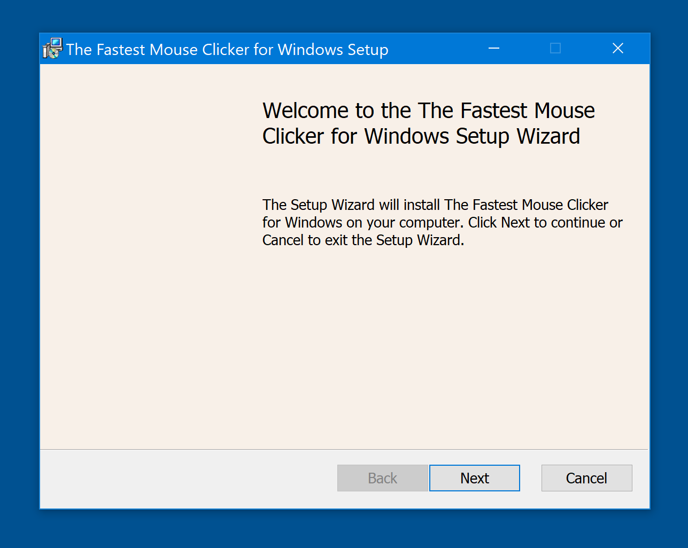

## {{ page.title | default: site.t['title'][page.lang] }}

### {{ page.description_rich | default: site.t['description_rich'][page.lang] }}

> Updated: Feb 11 2025. Added long-awaited tooltips for the trigger keys: now both virtual key codes and their names are displayed.
Added NEW Example Installer MSI Template project.

#### 2025 is the project's 9th anniversary

Hi! My name is [Masha Novedad](https://windows-2048.github.io/resume/){:target="_blank"}. I am open source programmer since 2016.
I write in vanilla C++.
I am an author of {{ site.t['app_name'][page.lang] }}.
All my applications are compact, standalone and statically-linked thus they have no external dependencies.
Windows installers are made for your convenience by open source tool [Inno Setup](https://jrsoftware.org/isinfo.php){:target="_blank"}.

## My Projects

* [The Fastest Mouse Clicker for Windows](https://windows-2048.github.io/The-Fastest-Mouse-Clicker-for-Windows/){:target="_blank"}

    

* NEW [Magic MSI Installer Template](https://github.com/windows-2048/Magic-MSI-Installer-Template){:target="_blank"}
* [2048 Game Professional for Windows](https://github.com/windows-2048/2048-Game-Professional-for-Windows){:target="_blank"}

### Welcome to download and install my flagship product!

<a href="{{ site.download_link_main }}" class="btn btn--stripe">Download {{ site.t['app_name'][page.lang] }} version {{ site.app_version }}</a>

### What's New - The latest version&nbsp;{{site.app_version}}

#### ChangeLog

* Added long-awaited tooltips for the trigger keys.
* Live current mouse position indicator gets light green color.
* Long waiting new feature FIXED POSITION CLICKING.
* Fixed blurred GUI texts on 4K screens.
* Fixed wrong question about close old application during installation.
* Few minor bug fixes.

## Copyright

Copyright (c) 2016-2025 by Open Source Developer Masha Novedad.
